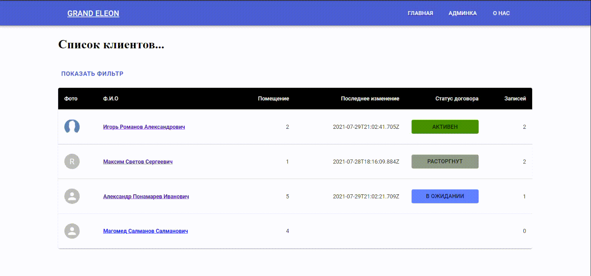

<h3 align="center">Trading House - сайт для арендодателя</h3>  

</br>


<!-- О проекте -->
<h2 id="about-the-project"> :pencil: О проекте</h2>

<p align="justify">
Trading House - сайт для арендодателя помещений в Торговом Доме.
На главной странице сайта оформлен вывод клиентов которые арендуют помещение, статус договора, помещение которое арендует клиент и т.д. При нажатии на клиента арендодатель может добавлять комментарии.
<p>




<p align="justify">
Также при клике на "админка" арендодатель может добавить человека который арендует у него помещение и добавить статус договора.
<p>

____
### Запуск проекта
Для запуска проекта вам необходимо набрать следующие команды в терминале по порядку:
```
npm i 
``` 
```
cd client
```

```
npm i
```
```
cd ..
```
И запустить проект командой:
```
npm run dev
```


### Основной функционал приложения:
- Список клиентов
- Возможность добавления клиентов
- Возможность добавления комментариев клиентам
- Возможность добавления статуса
- Возможность выбора и изменения статуса клиентам
- Информация о последних изменениях и о последнем статусе клиента
- Фильтрация по ФИО
___

## Технологии использованные в проекте

<p>
  
  
  
  
  
  
  
  
  
  
  
  
  
  
</p>
